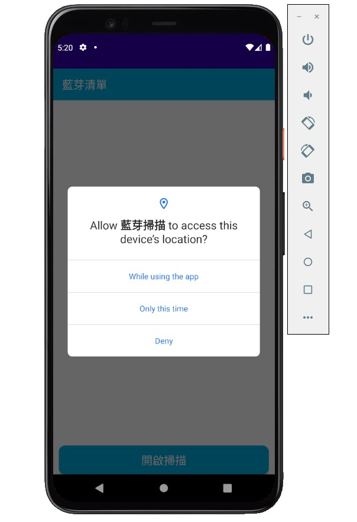
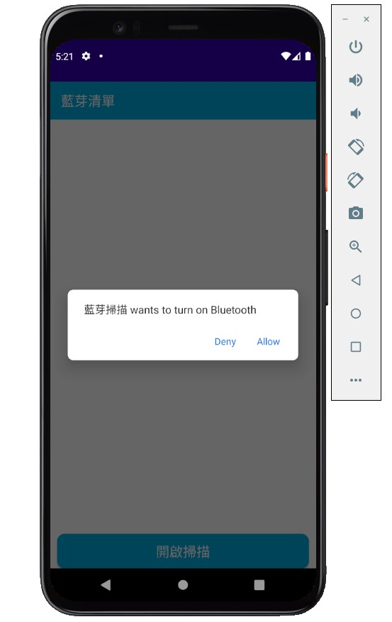

# Homework

步驟一、開啟【藍芽掃描App】

步驟二、點擊【進入】

步驟三、此時會跳出獲取位置訊息的權限，藍芽需要有位置訊息，因此請點【使用App期間允許】或是【允許一次】。

步驟四、點擊【開啟掃描】。

步驟五、若沒有手機沒有開啟藍芽，系統會詢問你是否開啟，點擊【允許】。

步驟六、空白畫面會顯示掃描到的Mac位址及訊號強度，其中訊號強度會隨你的位置改變，接著點擊【info 圖示】會自動關閉掃描，並進入詳細畫面。

步驟七、詳細畫面展示了Mac位址、訊號強度（並判斷訊號強弱）及訊號內容，點擊【返回】可繼續探索之前掃描到的裝置。

步驟八、點擊【開啟掃描】則會重新掃描，在掃描畫面頁點擊【返回】可直接退出程式。

