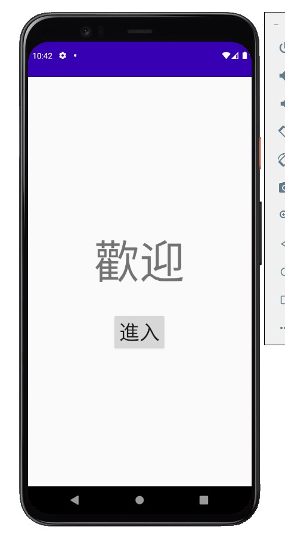

# Homework

步驟一、開啟【藍芽掃描App】

步驟二、點擊【進入】

步驟三、點擊【開啟掃描】，上方畫面將會顯示掃描到的Mac位址及訊號強度，其中訊號強度會隨你的位置改變。

步驟四、點擊【info 圖示】會關閉掃描，並進入
                詳細畫面，將展示Mac位址、訊號強度
                ( 並判斷訊號強弱 ) 及訊號內容。
步驟五、點擊返回可繼續探索之前掃描到的裝置
                ，再點擊開啟掃描則會重新掃描。
步驟六、在掃描畫面頁點擊返回直接退出程式。
