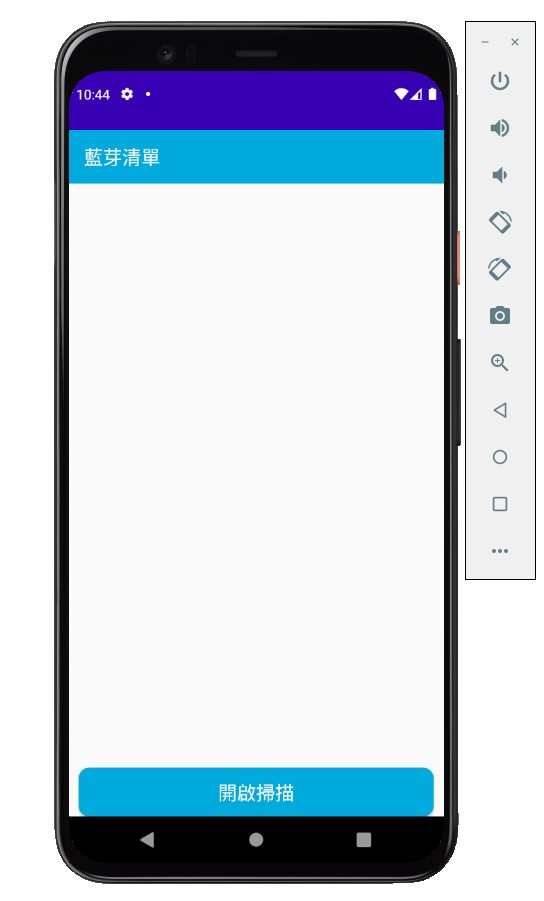
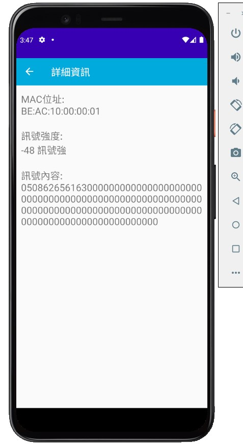
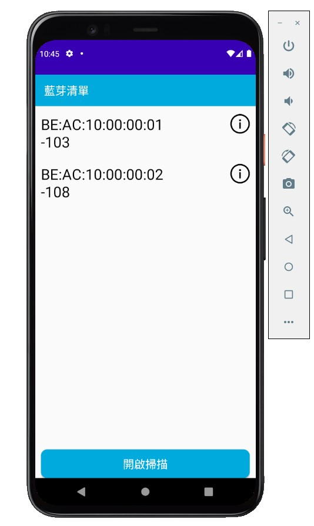

# Homework

步驟一、開啟【藍芽掃描App】

步驟二、點擊【進入】

步驟三、點擊【開啟掃描】，上方畫面將顯示掃描到的Mac位址及訊號強度。

步驟四、訊號強度會隨你的位置改變，接著點擊【info 圖示】會關閉掃描，並進入詳細畫面。

步驟五、詳細畫面展示了Mac位址、訊號強度（並判斷訊號強弱）及訊號內容，點擊返回可繼續探索之前掃描到的裝置。

步驟六、點擊開啟掃描則會重新掃描，在掃描畫面頁點擊返回可直接退出程式。

